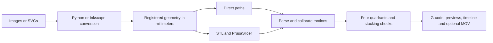

# Needle identity and image conversion sizes

The requested needle is **23 gauge × ½ inch long (12.7 mm)**. It is recorded in
`profiles/needle-23g-half-inch.yaml`, `config.example.yaml`, notebook controls,
SVG settings sidecars, and full-run manifests. Gauge and length have separate
confirmation flags. Bore, outside diameter, barrel, mounting clearance, deposited
line width and flow calibration are separate measurements; the needle profile
leaves them unresolved. Presets do not infer any of them from gauge or length.

`profiles/synthetic.yaml` retains invented values for offline previews. In particular,
its 0.3 mm bore and 1 mm bead are not measurements of this needle. The earlier image
report's 0.8 mm Prusa nozzle was also a labelled software fixture. Production checks
reject synthetic profiles and incomplete measurements/confirmations.

## Select a physical canvas size

Both `python` (the repository's OpenCV converter) and `inkscape` (native object-trace)
accept these starting settings. Width and height are maximum canvas dimensions;
each image keeps its aspect ratio. Originals remain unchanged.

| Preset | Canvas limit X × Y (mm) | Working pixels, longest side | Minimum island area (mm²) | Simplification (mm) |
| --- | --- | ---: | ---: | ---: |
| `small` | 25 × 31.25 | 800 | 0.001 | 0.010 |
| `medium` | 50 × 62.5 | 1,200 | 0.0025 | 0.025 |
| `large` | 75 × 93.75 | 1,600 | 0.005 | 0.040 |
| `quadrant` | Profile quadrant minus margins; 93.6 × 119 in the synthetic profile | 1,600 | 0.010 | 0.050 |

Threshold defaults to 128, with median denoising disabled to retain thin marks.
These are reviewable starting values, not a guarantee of faithful detail retention.
For a faint drawing, try explicit `--threshold 220 --denoise 0`; noisy images may
benefit from `--denoise 3`, which can erase thin features. An explicit `--width-mm`
overrides the fit but must remain inside the selected preset's envelope. Actual
traced bounds still undergo the pipeline's placement checks; overshoot is not cropped.

Run all commands from `bioprinter/` with its own environment:

```powershell
.\.venv\Scripts\python.exe -m bioprinter presets
.\.venv\Scripts\python.exe -m bioprinter vectorize INPUT.png OUTPUT.svg --backend inkscape --preset medium
.\.venv\Scripts\python.exe -m bioprinter vectorize INPUT.png OUTPUT.svg --backend python --preset small --threshold 220 --denoise 0
.\.venv\Scripts\python.exe -m bioprinter vectorize INPUT.png OUTPUT.svg --backend inkscape --preset quadrant --profile profiles/synthetic.yaml
```

Each vectorize command writes an SVG and a `.settings.json` sidecar containing
source hash, needle identity, physical scale and effective tracing settings.
Resize transforms explicitly map EXIF-oriented original pixels through the working
copy into normalized/local millimeters; working pixels are not passed off as originals.
Inkscape also retains its native trace, exact command and log in a fresh directory.
Normal SVG exports preserve the source canvas and offsets, so reimporting layers
does not silently enlarge a tight drawing boundary or move it to a new origin.
Diagnostic comparison SVGs are fitted to content for inspection and are explicitly
not registered layer exports. Existing SVG input bypasses bitmap tracing.

## Use the same settings throughout the pipeline

```powershell
.\.venv\Scripts\python.exe -m bioprinter compose examples/inputs --profile profiles/synthetic.yaml --preset small --vectorizer python --backend direct
.\.venv\Scripts\python.exe -m bioprinter compose examples/inputs --profile profiles/synthetic.yaml --preset small --vectorizer inkscape --backend direct
```

The notebook `notebooks/image_to_syringe_pipeline.ipynb` exposes `VECTOR_BACKEND`,
`SVG_PRESET`, optional `WIDTH_MM`, `TRACE_OPTIONS`, and `BACKEND`. Its batch panel
has the corresponding size, converter, threshold and slicer controls. Run All and
batch conversion stay offline. The workflow is:



Use `--manifest` for `order`, `sequences`, and `per_image` overrides. Each per-image
record can set `preset`, `width_mm`, threshold/filter settings and an explicit
registration matrix. Shared-canvas mode still rejects mismatched canvases; resizing
unrelated pictures independently does not establish layer registration. For an
intentional independent alignment, select `--registration per_design_bbox` explicitly.

PrusaSlicer receives the profile's bore as its nozzle dimension. The synthetic
default's 0.5 mm layer / 0.3 mm bore combination is rejected by PrusaSlicer; a 1 mm
extrusion width is also excessive for that test bore. Do not enlarge a nozzle value
to make the slicer accept a job. The complete integration test uses a separate,
explicit synthetic 0.2 mm layer / 0.4 mm bead fixture with the same invented 0.3 mm
bore, leaving the nominal 0.5 mm default unchanged. Real settings need measurement.

## Delivered comparison and reproducible verification

[Open the SVG size/converter comparison](../validation/dataset-runs/45-image-integration/svg-size-comparison/report.html):
three source images × four sizes × two converters, **24 generated SVGs**. The faint
`HANSBOX26000049.png` uses threshold 220 and denoise 0 explicitly. Its SVG success
does not establish successful slicing or preservation of every detail. Source hashes
and exact settings are stored with every result. The original 45-image slicing report
links to this comparison and now displays the specified needle identity.

```powershell
.\.venv\Scripts\python.exe -X utf8 scripts/compare_svg_presets.py "validation/dataset-runs/45-image-integration/inputs/DATA SET" --output validation/dataset-runs/NEW-SVG-COMPARISON --manifest examples/dataset-conversion-settings.json
.\.venv\Scripts\python.exe -X utf8 scripts/verify_full_pipeline.py --output validation/dataset-runs/NEW-PIPELINE-CHECK --summary validation/new-pipeline-summary.json
```

Use fresh output folders. The comparison manifest selects three representative
sources; omit it to compare all images. Full-pipeline verification covers both
converters crossed with both slicers, three synthetic input shapes, all four
quadrants, SVG canvas round-trips and final output preflight. It never contacts a
printer. Exact tested results and limitations are recorded in `VALIDATION.md`.
